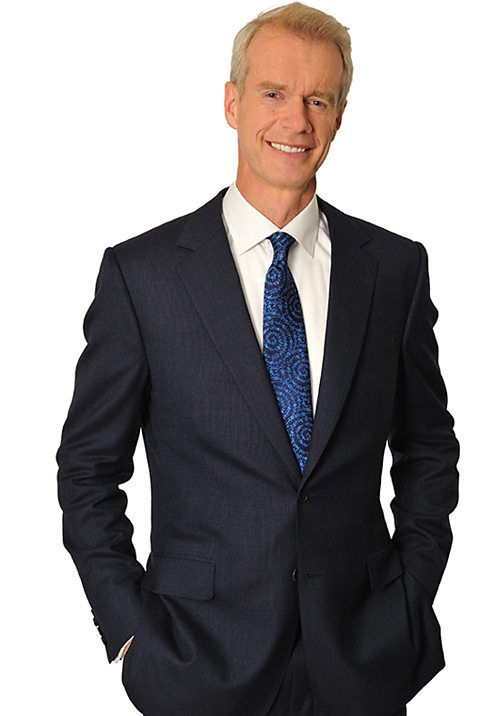

# Coronavirus | Laurence Boone, OECD, on the global response to COVID-19

# Who Talks | *HARDtalk*

## Stephen Sackur

{width=400px}

Stephen Sackur is an English journalist who presents HARDtalk, a current
affairs interview programme on BBC World News and the BBC News Channel. For
fifteen years he was a BBC foreign correspondent.

## Laurence Boone

{width=400px}

Laurence Boone is a French economist whose fields of interest include
macroeconomics, European politics and public finance.

# The Interview | *HARDtalk*

## Characteristics of the interview

- Sackur constantly interrupts his guest
- Puts his opinion first
- Calls Boone a born-optimist implying that she's wrong

## Issues discussed

1. Are actions matching the words when it comes to trying to safeguard the
   world economy?
2. Panic on financial markets
3. Exaggeration of amount of damage to corporate life
4. Biggest problems going forward
5. No cooperation unlike in 2008, each country is fighting for itself
6. Is there going to be a global recession or even depression? Debt problem
   after the coronavirus is over
7. What have we learned about our world during the pandemic?
8. Environmental conditions have improved during the pandemic due to reduced
   economic activity of people. Are we going to learn from that?

# Conclusion | *HARDtalk*

# Thanks for your attention
